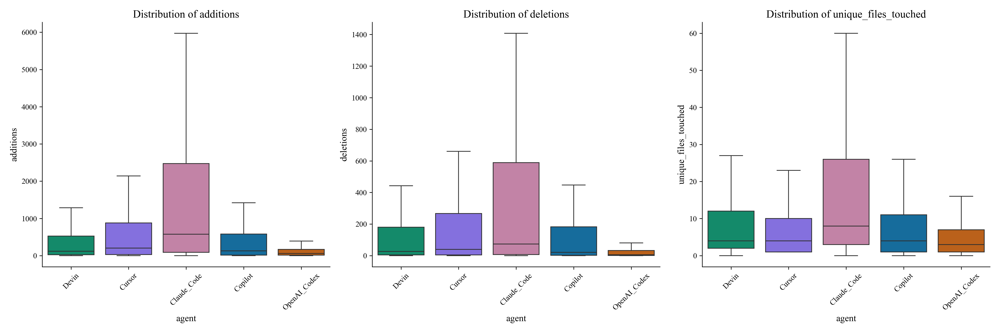
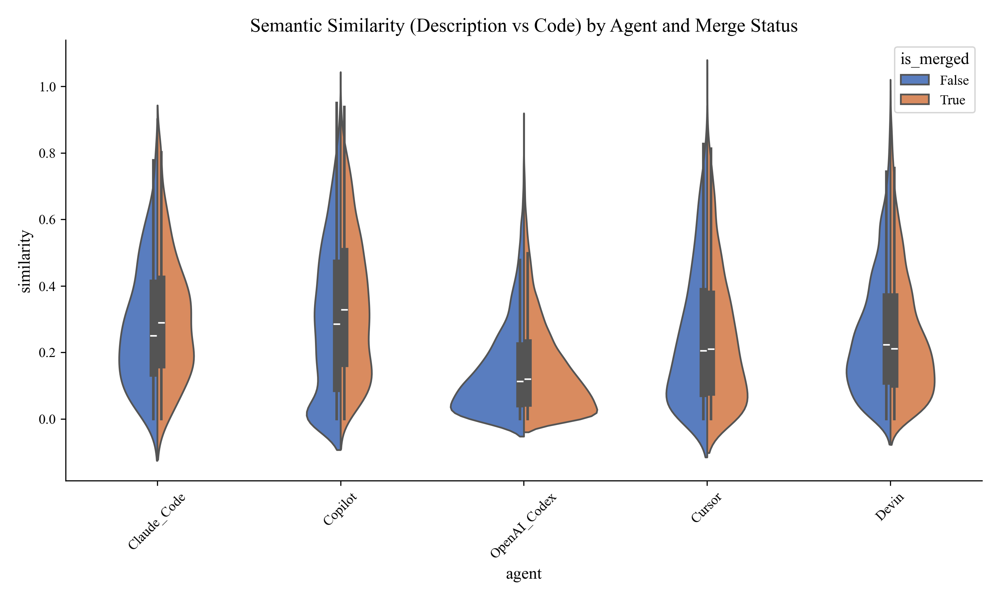
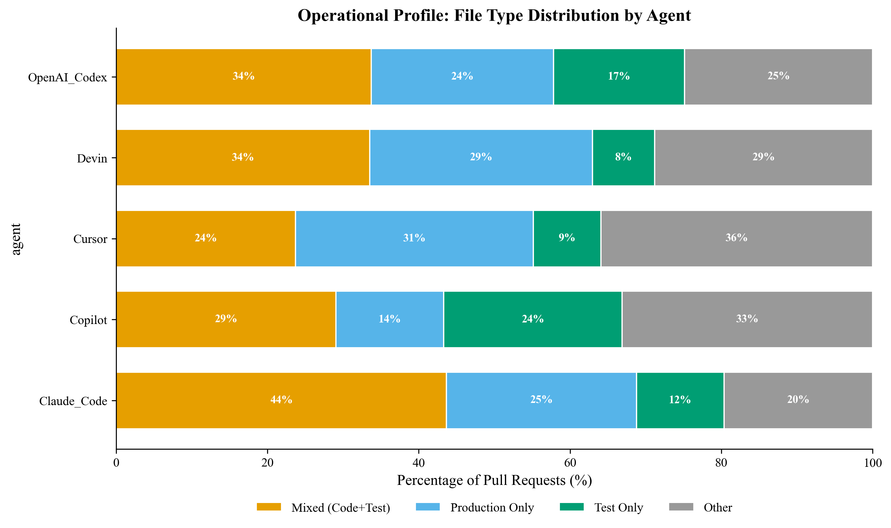
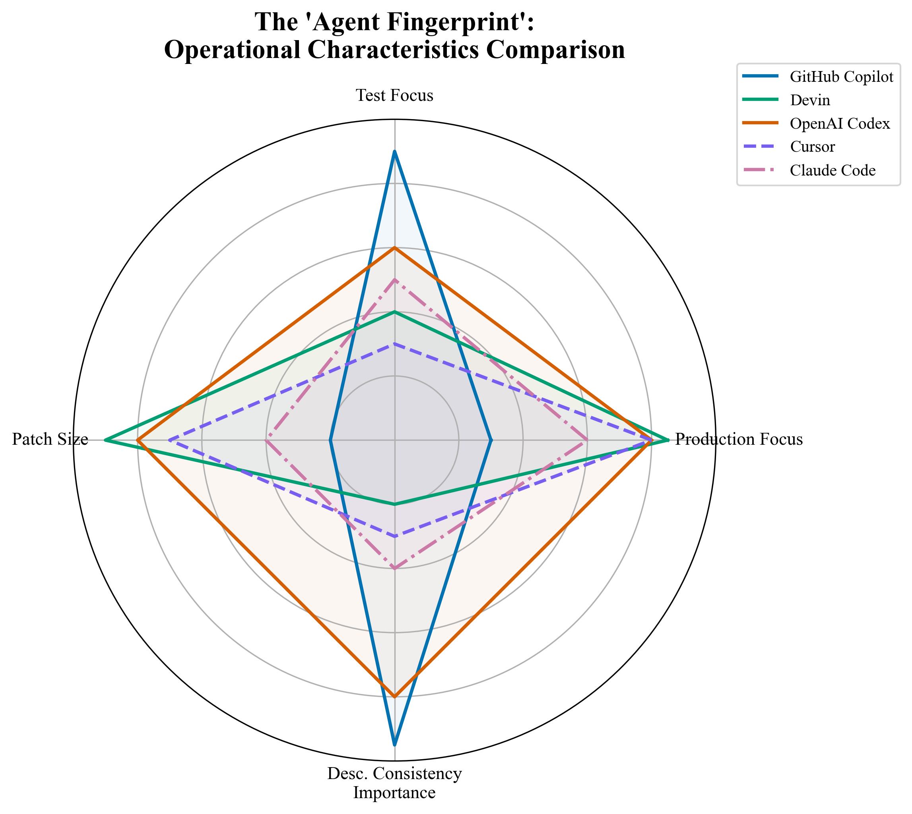

# From Assistants to Agents: A Characterization of AI-Generated Pull Requests

**Abstract**
The role of AI in software engineering is shifting from code completion assistants to autonomous agents capable of generating entire Pull Requests (Agentic-PRs). While adoption is growing, the characteristics of these Agentic-PRs remain under-explored. This study analyzes the *AIDev* dataset to characterize the behavior of five prominent AI agents: GitHub Copilot, OpenAI Codex, Devin, Cursor, and Claude Code. Our results reveal significant differences in their operational profiles: while Copilot is predominantly used for testing and smaller fixes, agents like Devin and Codex engage in complex feature implementation. Crucially, we find a "Trust Paradox": for assistive tools like Copilot, semantic consistency between description and code correlates with merge success; however, for autonomous agents like Devin, this correlation vanishes, suggesting a fundamental shift in how human reviewers interact with and trust agent-generated code.

---

## I. Introduction
Generative AI has revolutionized software development, evolving from inline code completion (e.g., early GitHub Copilot) to "Agentic" workflows where AI systems autonomously plan, code, and submit Pull Requests (PRs). Despite this rapid evolution, empirical understanding of *Agentic-PRs* is limited. Do agents behave like human junior developers? Do they focus on specific types of tasks? How do human reviewers perceive and accept their contributions?

This paper presents an empirical study of Agentic-PRs, addressing three research questions:
*   **RQ1 (Patch Characteristics):** How do Agentic-PRs differ in scale and scope (additions, deletions, files touched)?
*   **RQ2 (Description Consistency):** Does the semantic consistency between the PR description and the actual code change affect merge success?
*   **RQ3 (File Type Distribution):** What types of files (Production vs. Test) do different agents tend to modify?

## II. Methodology
### A. Dataset
We utilize the **AIDev** dataset (Enriched Subset), focusing on PRs from popular repositories to ensure data quality. The dataset includes contributions from five distinct AI agents: GitHub Copilot, OpenAI Codex, Devin, Cursor, and Claude Code.

### B. Metrics & Analysis
*   **Patch Characteristics:** We measure Total Additions, Total Deletions, and Unique Files Touched per PR. We use the **Kruskal-Wallis H-test** to evaluate statistical differences between agents.
*   **Semantic Consistency:** We calculate the **Cosine Similarity** between the TF-IDF vectors of the PR description (Title + Body) and the concatenated code patch. We use the **Mann-Whitney U test** to compare scores between Merged and Unmerged PRs.
*   **File Type Classification:** Files are classified into *Production*, *Test*, and *Config/Docs* using heuristic rules (e.g., file paths containing "test", "spec", or specific extensions).

---

## III. Results

### RQ1: Patch Characteristics
*Are agents distinct in their output scale?*

The Kruskal-Wallis test reveals statistically significant differences among all five agents for additions ($p \approx 2.7e^{-242}$), deletions ($p \approx 0.0$), and file counts ($p \approx 2.4e^{-90}$).
*   **Observation:** Agents do not exhibit a uniform "AI style." Instead, they show distinct operational profiles. Some agents produce large, scaffolding changes, while others focus on atomic, surgical edits.

*Figure 1: Distribution of additions, deletions, and unique files touched across AI agents.*

### RQ2: Description Consistency
*Does accurate description matter for acceptance?*

We analyzed the relationship between description-code consistency and merge status:
*   **GitHub Copilot:** $p = 2.27e^{-17}$ (Significant). Consistent descriptions strongly correlate with merged PRs.
*   **OpenAI Codex:** $p = 0.024$ (Significant).
*   **Devin / Cursor / Claude Code:** $p > 0.05$ (Not Significant).

*   **Observation:** There is a clear dichotomy. For assistive tools (Copilot), "doing what you say" is critical for acceptance. For autonomous agents (Devin, Cursor), this metric is decoupled from merge success.

*Figure 2: Semantic similarity between PR description and code patch, split by merge status.*

### RQ3: File Type Distribution
*What tasks do agents perform?*

Chi-square tests ($p \approx 9.5e^{-199}$) confirm significant dependence between agent type and file category:
*   **Copilot:** Disproportionately high volume of **"Test Only"** patches.
*   **OpenAI Codex & Devin:** High volume of **"Production Only"** and **"Mixed"** (Production + Test) patches.
*   **Claude Code:** Balanced mix, though lower volume in this subset.

*Figure 3: Operational Profile. Stacked bar chart showing the percentage of file types touched per PR. Note the contrast between Copilot's test-heavy profile and Devin's production-heavy profile.*

---

## IV. Qualitative Analysis & Discussion

To contextualize our statistical findings, we examine two representative PRs that highlight the operational differences between agents.

### A. Case Studies

**Case 1: The Targeted Fixer (GitHub Copilot)**
*   **PR:** *Fix MTP runner to report error...* (Repo: `dotnet/arcade`)
*   **Profile:** This PR modifies a specific testing target file (`Microsoft.Testing.Platform.targets`) to handle a subtle edge case with `.dll` files.
*   **Insight:** The PR includes a detailed description explaining the logic error ("incorrectly handling... by executing directly"). This aligns with our RQ2 finding: for Copilot, acceptance relies on a human reviewer understanding and trusting the specific, atomic change description.

**Case 2: The Feature Developer (Devin)**
*   **PR:** *feat(stripe): add adoption pattern to all Stripe resources* (Repo: `sam-goodwin/alchemy`)
*   **Profile:** This is a massive "scaffolding" PR. It touches 26 files and adds ~1,000 lines of code, implementing a new design pattern across the entire `stripe/` module (e.g., `card.ts`, `client.ts`, `coupon.ts`).
*   **Insight:** The scale of this change (RQ1) makes manual verification of "description vs. code consistency" (RQ2) impractical. The acceptance of such a PR likely depends on passing the test suite and high-level functional correctness, rather than the granular semantic alignment that matters for Copilot.

### B. From "Assistant" to "Agent"
The data suggests a functional classification of AI tools:
1.  **The Test-Writing Assistant (Copilot):** Its high prevalence of "Test Only" patches and smaller change sizes aligns with a workflow where developers use it to offload tedious tasks like unit testing.
2.  **The Feature Developer (Devin/Codex):** These agents touch production code and mixed files significantly more often, behaving closer to a human developer implementing a feature (code + corresponding tests).

### B. The Trust Paradox (Interpreting RQ2)
The most striking finding is the divergence in RQ2. Why does description consistency matter for Copilot but not for Devin?
*   **Hypothesis 1: Reviewer Behavior Shift.** When reviewing a small Copilot suggestion, humans may rely on the description to quickly verify intent. If the description matches the code, it's merged.
*   **Hypothesis 2: Complexity Overload.** Devin's PRs are often larger and more complex (RQ1). Reviewers may find it difficult to manually verify the semantic alignment. Instead, they may rely on **proxy metrics** like "Did the CI pass?" or "Does the feature work?" rather than "Is the description accurate?".
*   **Hypothesis 3: The "Agentic Bias."** Users might implicitly trust high-autonomy agents (marketed as "AI Software Engineers") more than autocomplete tools, accepting their code even when the description is vague or mismatched.

*Figure 4: The Agent Fingerprint. A radar chart summarizing the operational characteristics of five agents. Note the distinct shapes: Copilot (Solid Blue) spikes in Testing and Description Consistency; Devin (Solid Green) and Cursor (Dashed Purple) dominate in Patch Size and Production Focus; Claude Code (Dash-dot Red) occupies a middle ground.*

## V. Implications

*   **For Tool Builders:** Agents are being used for distinct tasks. Optimization goals should differ: "Assistant" models should optimize for *correctness of small contexts*, while "Agent" models need to optimize for *system-level coherence* and *integration testing*.
*   **For Code Review:** Traditional code review assumes a human author who can explain their logic. As Agentic-PRs become common, we need **AI-Aware Review Tools** that can automatically verify if the generated code matches the high-level intent, as human reviewers may be bypassing this check for complex agents.

## VI. Conclusion
Our analysis of the AIDev dataset characterizes the transition from AI assistants to AI agents. We find that agents are not created equal: they have distinct signatures in terms of patch size, file focus, and—most critically—how their consistency correlates with human acceptance. As agents take on more "Production" work, the dynamics of human-AI collaboration in code review must evolve to maintain software quality.
