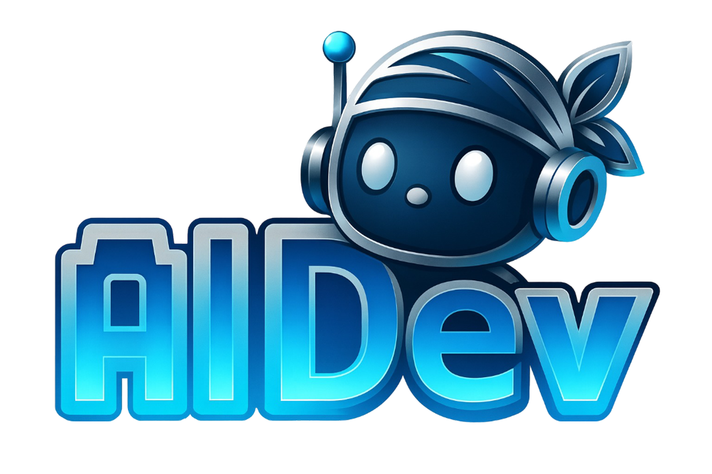
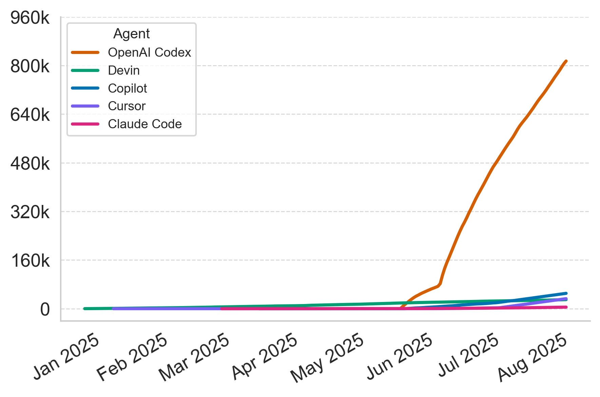
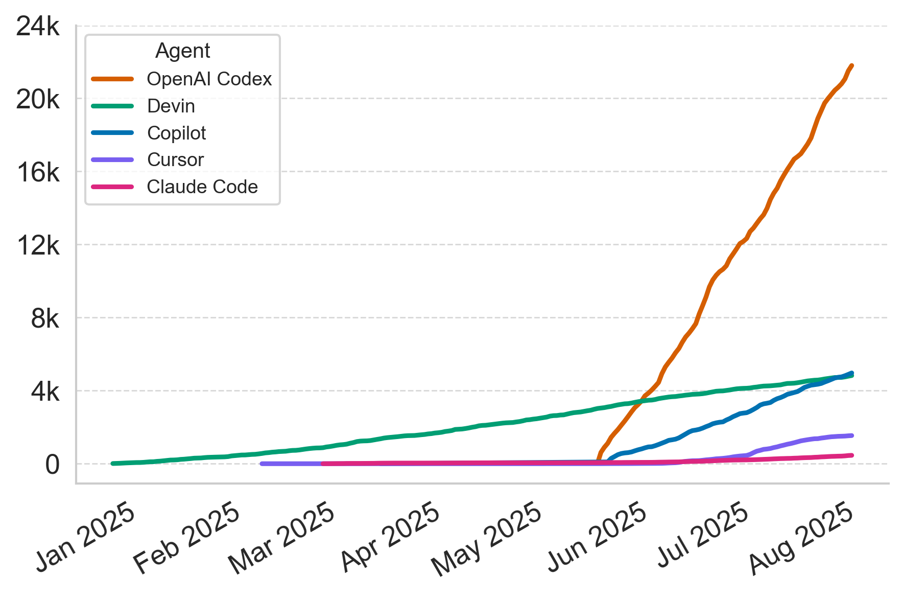

<p align="center">
  
</p>

# AIDev: Studying AI Coding Agents on GitHub (The Rise of AI Teammates in Software Engineering 3.0)

📢 We’re hosting the **MSR 2026 Mining Challenge** (co-located with **ICSE 2026** in **Rio de Janeiro, Brazil**). Details and submissions:  
⚠️⚠️⚠️ [https://2026.msrconf.org/track/msr-2026-mining-challenge](https://2026.msrconf.org/track/msr-2026-mining-challenge) ⚠️⚠️⚠️

[](https://arxiv.org/abs/2507.15003)
[](https://huggingface.co/datasets/hao-li/AIDev)
[](https://doi.org/10.5281/zenodo.16919272)

- **Paper:** https://arxiv.org/abs/2507.15003
- **HuggingFace Dataset:** https://huggingface.co/datasets/hao-li/AIDev
- **Example Notebooks:** 

| Description                          | Notebook Link                                                                                       | Open in Colab                                                                                                                |
|--------------------------------------|------------------------------------------------------------------------------------------------------|-----------------------------------------------------------------------------------------------------------------------------|
| Basic usage                          | [load_AIDev.ipynb](analysis/load_AIDev.ipynb)                                                       | <a href="https://colab.research.google.com/github/SAILResearch/AI_Teammates_in_SE3/blob/main/analysis/load_AIDev.ipynb" target="_parent"></a> |
| Dataset overview                     | [dataset_overview.ipynb](analysis/dataset_overview.ipynb)                                           | <a href="https://colab.research.google.com/github/SAILResearch/AI_Teammates_in_SE3/blob/main/analysis/productivity.ipynb" target="_parent"></a> |
| Analysis of programming usage        | [language_usage.ipynb](analysis/language_usage.ipynb)                                               | <a href="https://colab.research.google.com/github/SAILResearch/AI_Teammates_in_SE3/blob/main/analysis/language_usage.ipynb" target="_parent"></a> |
| PR merge rate and turnaround time    | [productivity.ipynb](analysis/productivity.ipynb)                                                   | <a href="https://colab.research.google.com/github/SAILResearch/AI_Teammates_in_SE3/blob/main/analysis/productivity.ipynb" target="_parent"></a> |

> ⚠️ **Update (Aug 10, 2025):** The dataset has been refreshed to include data up to **August 1, 2025**, ensuring 
> our dataset reflects the most recent trends in coding agents.

This repository contains the replication package for the paper "The Rise of AI Teammates in Software Engineering (SE)
3.0: How Autonomous Coding Agents Are Reshaping SE". Due to the size limit of GitHub repositories, the full dataset is
not included here. You can find our full dataset on HuggingFace: https://huggingface.co/datasets/hao-li/AIDev

> If you're interested in the raw data of AIDev-pop, you can find them here: https://drive.google.com/file/d/1l0_RjS7ZT0Y27V3mv0oJK-jfeRkhq5l5/view?usp=drive_link

## Overview

The overview of the AIDev dataset is as follows:

|                  | #PR         | #Developer | #Repo       |
| ---------------- | ----------- |------------|-------------|
| `OpenAI Codex`   | 814,522     | 61,653     | 84,704      |
| `Devin`          | 29,744      | NA         | 4,747       |
| `GitHub Copilot` | 50,447      | NA         | 14,492      |
| `Cursor`         | 32,941      | 9,658      | 12,699      |
| `Claude Code`    | 5,137       | 1,643      | 1,915       |
| **Total**        | **932,791** | **72,189** | **116,211** |



## Repository Structure

```
├── AIDev-pop/              # AIDev-pop subset of AIDev
├── analysis/              # Analysis scripts and Jupyter notebooks
├── figs/                  # Generated figures and results
├── requirements.txt       # Python dependencies
└── README.md             # This file
```

## Installation

Install required dependencies:

```bash
pip install -r requirements.txt
```

## Key Findings

The key findings from the analysis of are based on AIDev-pop, a subset of the AIDev dataset.

### AIDev-pop: Filtered (>100 stars)

|                  | #PR        | #Developer | #Repo     |
| ---------------- | ---------- |------------| --------- |
| `OpenAI Codex`   | 21,799     | 1,284      | 1,248     |
| `Devin`          | 4,827      | NA         | 288       |
| `GitHub Copilot` | 4,970      | NA         | 1,012     |
| `Cursor`         | 1,541      | 363        | 327       |
| `Claude Code`    | 459        | 236        | 213       |
| **Total**        | **33,596** | **1,796**  | **2,807** |



### Productivity in the Coding Agents Era


### Turnaround Time


[//]: # ()
[//]: # (![]&#40;figs/copilot_job_completion_time.png&#41;)

[//]: # ()
[//]: # (**GitHub Copilot delivers half of its PRs within 12.8 minutes**. While 75% of jobs are completed within 18.5 minutes, the distribution)

[//]: # (exhibits a long tail extending up to 60 minutes, with the 95th percentile exceeding one hour. )
[//]: # ()
[//]: # (### Who Review the PRs?)

[//]: # ()
[//]: # (![]&#40;./figs/reviewer_classification_stacked.png&#41;)

[//]: # ()
[//]: # (**Human reviewers remain dominant across Agentic-PRs yet GitHub Copilot drives a shift)

[//]: # (toward automated hybrid collaboration in review**. Both Human-PRs and Agentic-PRs receive)

[//]: # (no explicit review in the majority of cases &#40;75.3% and 58.2%, respectively&#41;, while the second most common category)

[//]: # (involves reviews conducted solely by humans, at 14.7% and 21.8%. Notably, bot reviewers are more prevalent in Agentic-)

[//]: # (PRs &#40;20.1%&#41; than in Human-PRs &#40;10.0%&#41;. )

[//]: # ()
[//]: # (![]&#40;./figs/bot_heatmap.png&#41;)

[//]: # ()
[//]: # (**Autonomous Coding Agents and their paired review bots often originate from the same)

[//]: # (provider, forming closed PR-review loops that streamline workflows; but risk reinforcing provider-specific)

[//]: # (biases.** We analyze the top 10 most active review bots to understand on which Autonomous Coding Agents they operate.)

[//]: # (The heatmap illustrates a strong association between review bots and Autonomous Coding Agents from the same provider.)

### Language Usage


**Autonomous Coding Agents exhibit distinct language preferences reflecting domain specialization in their capabilities.** 
TypeScript is the most common language across all agents, underscoring its popularity in AI-assisted development.
However, notable divergences emerge: OpenAI Codex shows a pronounced skew toward Python, while GitHub
Copilot heavily favours C#, likely reflecting their respective integrations and user bases.

## Dataset Schema


## Citation

If you use this dataset or code in your research, please cite our paper:

```bibtex
@misc{li2025aiteammates,
      title={The Rise of AI Teammates in Software Engineering (SE) 3.0: How Autonomous Coding Agents Are Reshaping Software Engineering}, 
      author={Hao Li and Haoxiang Zhang and Ahmed E. Hassan},
      year={2025},
      eprint={2507.15003},
      archivePrefix={arXiv},
      primaryClass={cs.SE},
      url={https://arxiv.org/abs/2507.15003}, 
}
```
